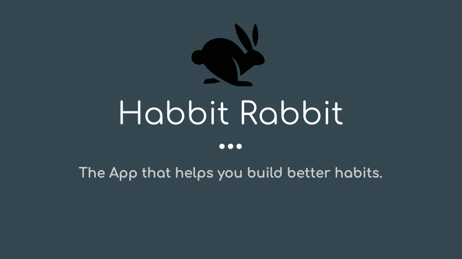
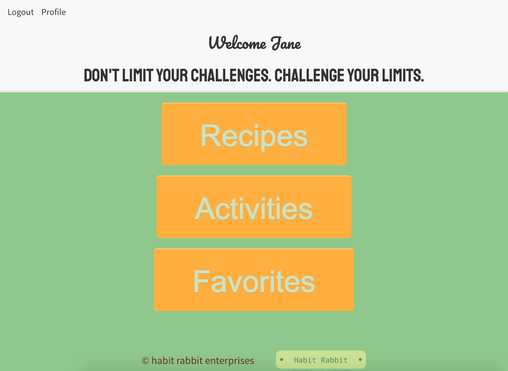
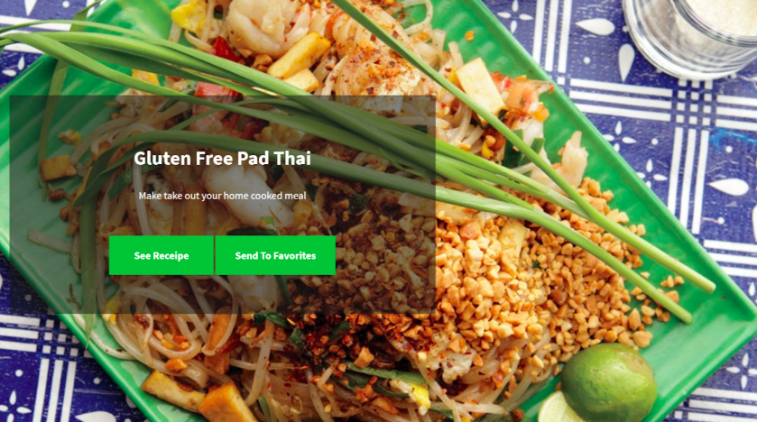
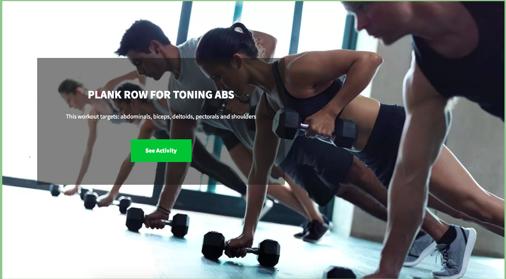
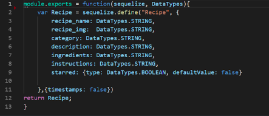
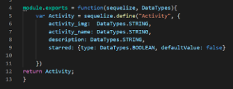
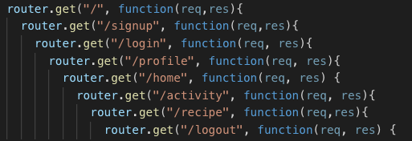
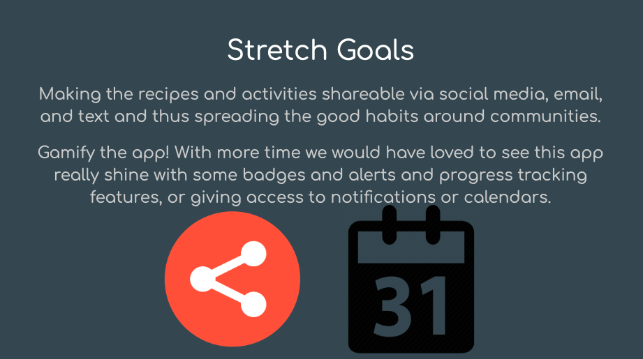

# Habbit Rabbit :rabbit:

Habbit Rabbit helps you build better lifestyle habits, starting with diet and exercise.  By providing recipes based on your dietary preferences and exercise activites based on your capabilities, Habbit Rabbit allows you to have a menu of healthy choices at your fingertips, taking the guesswork out of what to cook tonight or what exercise to choose. The goal is to eliminate unhealthy last minute choices to get fast food or sit at home and watch TV. With this tool, you can start living your best life by forming good habits.

## Getting Started

Sign up is necessary for this amazing web app. Provide your name, email, age, password, and dietary preference, so we can cater to your needs and interests. 

Once you’re all signed up, go ahead and login! The app will welcome you by name! And give you a couple of options to choose from, recipes, activities, or favorites(coming back to this later). 

If it’s a cooking opportunity, and you’re still exploring your options, go ahead and click the recipes button and we’ll show you a ton of great recipes!

If it’s time to get moving, and you’re not sure what to do, go ahead and click the activities button, and we’ll give you some workouts to try!

## Models

Habbit Rabbit was built on an MVC architecture with handlebars.

Recipe model

Activity Model

User Model

## Routes

## Database

## Login Authorization

HabbitRabbit uses Passport authentication to keep user data secure with bcrypt, and express-session middleware which uses cookies so users can keep logging in again and again. 

## Planned Features

## Deployment

Visit our deployed site [here]()!

## Built With

* [HTML5 & CSS3]()
* [Bootstrap]() - CSS framework
* [Javascript]() - Programming language
* [Node.js]() - Javascript runtime
* [Express.js]() - Routing framework
* [Handlebars]() - Semantic templating
* [Owl Carousel 2]() - Carousel used

## NPM Packages

* [bcrypt-nodejs]() - Encrypt user password
* [body-parser]() - Request parsing middleware
* [Express]() - Server-side framework
* [Express-Handlebars]() - Semantic templates for HTML generation
* [Express-session]() - Middleware for session data
* [mySQL2]() - Make server-side SQL queries
* [node-sass]() - CSS library used
* [passport]() - Authenticate requests
* [passport-local]() - Local login authentication
* [sequelize]() - ORM for SQL database

## Authors

* **Melika Kalbasi** - *Initial work* - [melikalbasi](https://github.com/melikalbasi)

* **Michael True** - *Initial work* - [mdtrue](https://github.com/mdtrue)

* **Lindsey Walker** - *Initial work* - [lindsnicolewalker](https://github.com/lindsnicolewalker)

* **Michael Wu** - *Initial work* - [wufasa](https://github.com/wufasa)

## License

This project is licensed under the MIT License - see the [LICENSE.md](LICENSE.md) file for details

## Acknowledgments

* Big thank you to Denis, our awesome tutor, our TAs, Jimmy and Sasha, and our professor Jerome!